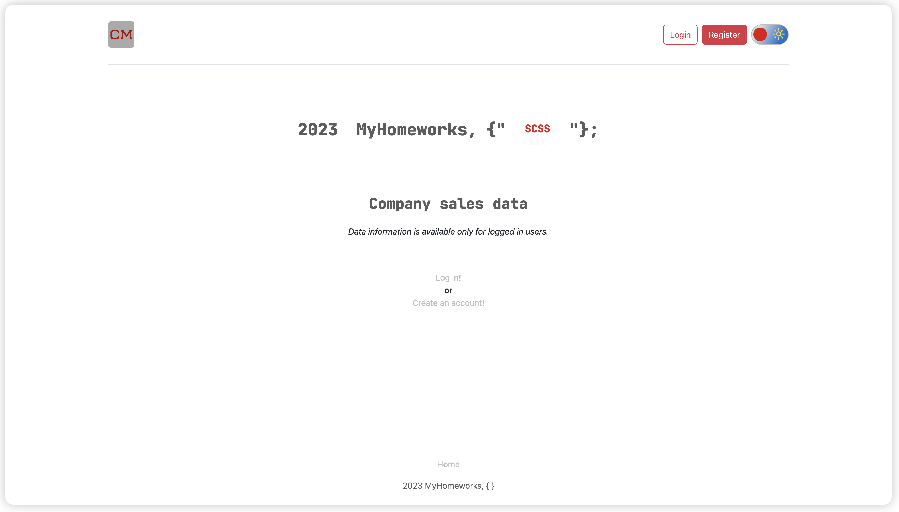
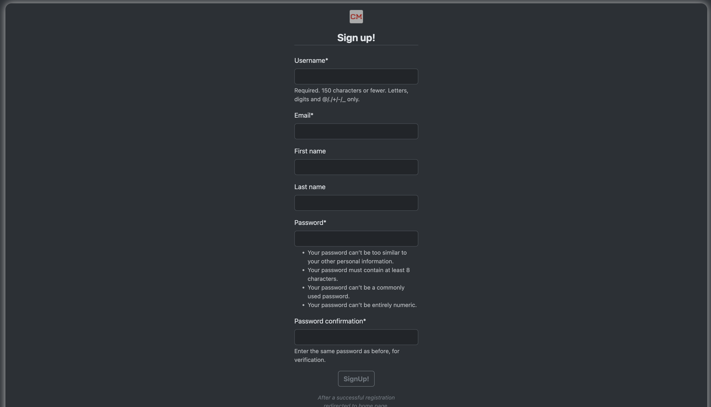
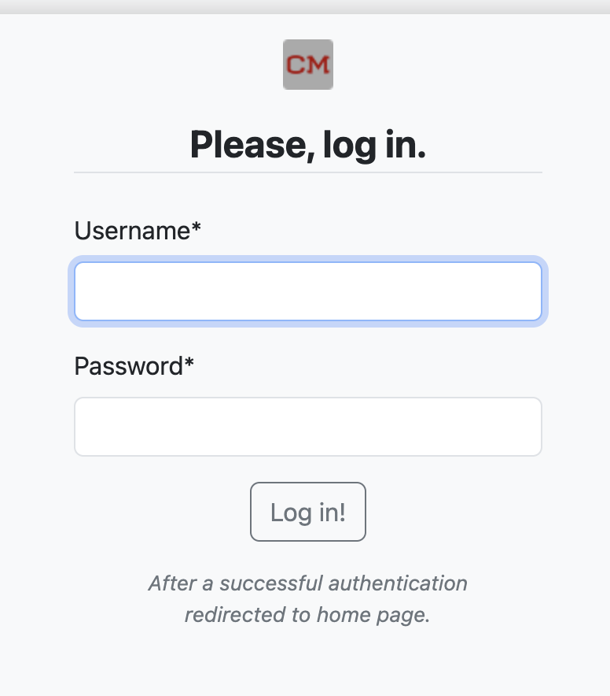
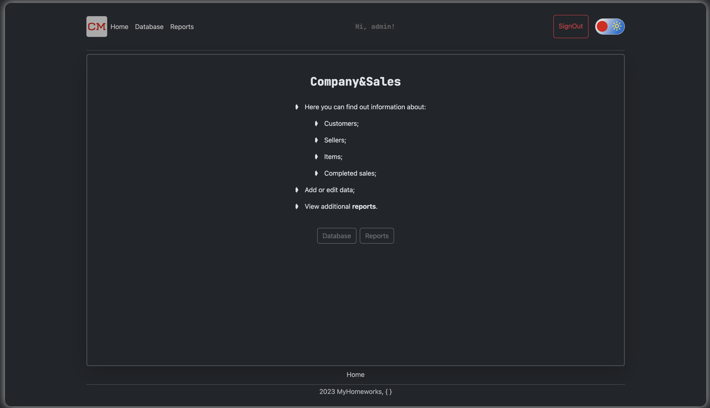
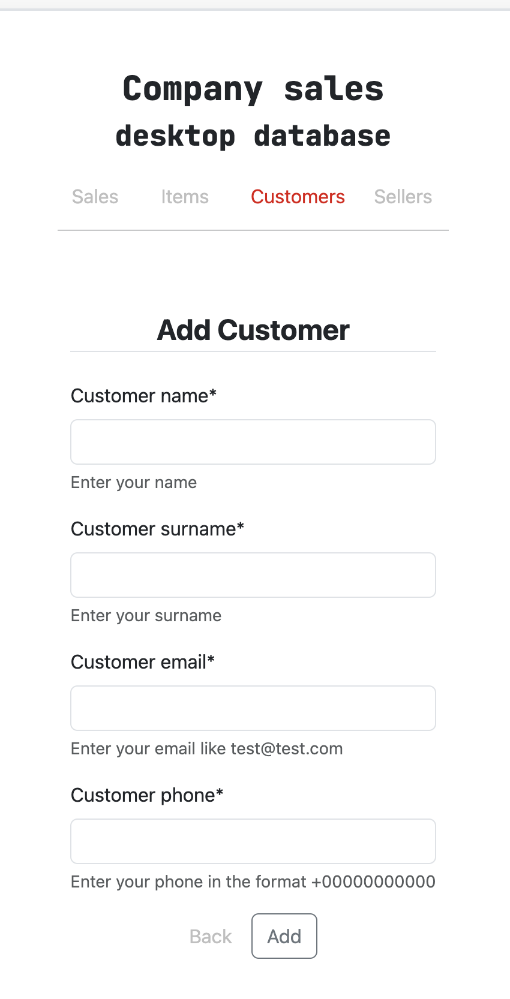
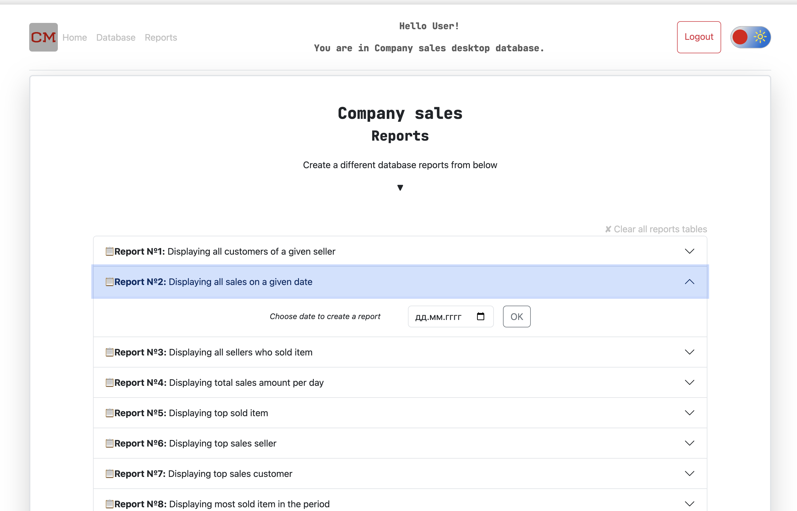

## Description
This is a Django test project using MYSQL and Docker.


## Launch instructions


1. Clone repository to your local folder;
2. Install all packages from requirements.txt: ```pip install -r requirements.txt```;
3. Insatll all packages from package.json: ```cd ./static && npm install```;
4. Copy dev.env to .env file: ```cp dev.env .env```
5. Follow the instructions in new created .env file;
6. For this step you should already have installed Docker and docker-compose on your PC:
- Run docker-compose: ```docker-compose up --build```
- Installation can take some time, it depends on your PC resources;
- After the installation is completed, the server will start automatically on 0.0.0.0:8800;
7. To stop the server: ```Ctrl+C```
8. To completely remove all created docker containers, images and volumes: ```docke-compose down --volumes```.

*p.s. points № 2 and 3 are not necessary* 

### Screenshots 

1. Main page


2. Registration form


3. Login form


4. Data


5. Add data form


6. Reports list
